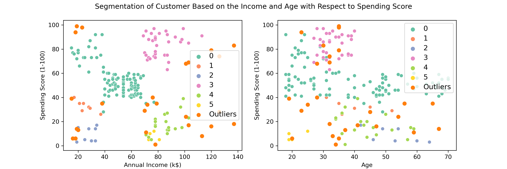

# Mall Customer Segmentation with DBSCAN Clustering
This project focuses on segmenting customers in a mall dataset using the Density-Based Spatial Clustering of Applications with Noise (DBSCAN) clustering method.

## Overview
Customer segmentation is a crucial strategy for businesses aiming to understand their customers better and tailor marketing strategies to specific segments. In this project, we employed DBSCAN clustering to group customers based on their spatial density, allowing us to uncover distinct customer segments within the dataset.

## Key Features

- Utilizes the DBSCAN algorithm for efficient clustering of customer data.
- Scalable approach suitable for handling large datasets.
- Flexibility to customize clustering parameters to adapt to different datasets and business requirements.

## Results

- Identified meaningful customer segments based on Annual Income and Spending Score on the scale of 1-100 features.
- Analyzed cluster profiles to gain insights into customer preferences and Spending behavior.
- Provided actionable recommendations for targeted marketing strategies and personalized customer experiences.

## How to Use

1. Clone the repository
2. Install dependencies present in the `requirements.txt`
3. Run the `customer-segmentation.ipynb` file in your jupyter notebook.
4. Explore the results and insights generated from the clustering analysis.

## Contributing

Contributions to this project are welcome! If you have suggestions for improvements or feature enhancements, please feel free to submit a pull request.

## License
This project is licensed under the MIT License - see the [LICENSE](LICENSE) file for details.